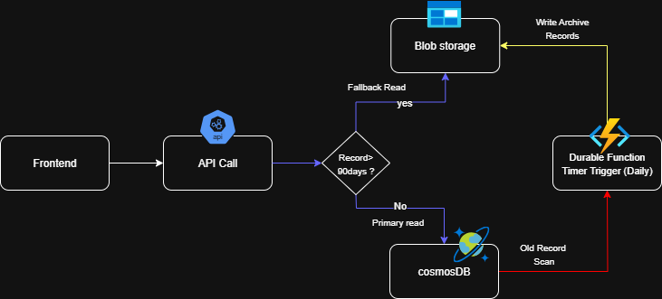

# Azure Cost Optimization: Managing Billing Records in Serverless Architecture

## Problem Statement

We're running a serverless architecture in Azure using **Cosmos DB** to store billing records. Now:

- We have **2M+ records**, each up to **300KB**.
- It's a **read-heavy system**.
- **Records older than 3 months are rarely accessed**, but still need to be available within **seconds** when needed.
- 📈 **Cosmos DB costs are ballooning** due to retained historical data.

---

## 🚧 System Constraints

- **No data loss**  
- **No service downtime**  
- **No changes to current API contracts**  
- **Simple to implement and maintain**

---

## ✅ Solution Overview: Tiered Storage Strategy

We optimize costs using a **Hot/Cold storage model**:

- **Hot Tier:** Cosmos DB stores recent records (≤ 3 months).
- **Cold Tier:** Azure Blob Storage (Cool/Archive tier) holds older records (> 3 months).
- API layer tries Cosmos DB first, then **fallbacks to Blob** if data is not found.

---

## 🧱 Architecture Diagram



---

## 🛠️ Core Azure Components

| Component            | Purpose                                 |
|----------------------|-----------------------------------------|
| Azure Cosmos DB      | Hot storage for active billing records  |
| Azure Blob Storage   | Cold storage for archived data          |
| Azure Functions      | API layer, read/write logic             |
| Azure Durable Func   | Scheduled archival of old records       |
| Azure Event Grid     | Trigger archival workflows (Timer)      |

---

## Blob Storage Structure

Organize cold records efficiently for retrieval & indexing:

- **Container**: `billing-archive`
- **Path Format**: `YYYY/MM/DD/record_id.json`

**Example:**  
`billing-archive/2024/03/15/invoice-abc123.json`

---

## Archival Logic (Azure Durable Function)

- Triggered via **Timer (Daily/Weekly)**.
- Moves data older than 3 months to Blob.
- Deletes the data from Cosmos DB after archiving.

```python
# Pseudocode
from azure.storage.blob import BlobServiceClient
from azure.cosmos import CosmosClient

COSMOS_QUERY = "SELECT * FROM c WHERE c.timestamp < @cutoff"

async def archive_old_records():
    records = query_cosmos(COSMOS_QUERY)
    for record in records:
        write_to_blob(record)
        delete_from_cosmos(record.id)
```
## Read API Logic (Seamless Fallback)

- Read logic remains unchanged from the consumer's view.
- Attempt to read from Cosmos DB
- If not found → fallback to Blob Storage

```python
# Pseudocode
def get_billing_record(record_id):
    record = read_from_cosmos(record_id)
    if record:
        return record
    else:
        return read_from_blob(record_id)
```
## Blob used
- Use Cool Tier for cost-effective storage
- Enable Blob Indexing for faster lookup
- Enable Azure Blob Lifecycle Management to auto-transition cold data to Archive Tier over time

## Benefits of having this solution
- Major cost savings by moving cold data out of Cosmos DB
- No change to existing API contracts
- Zero downtime during migration
- Fully serverless & scalable
- Easy to monitor, maintain, and extend

## Conversation history with ChatGPT 4.1 LLM model
[Conversation Link](https://chatgpt.com/share/6871c781-9688-8001-b422-cad6e5489ce2)


